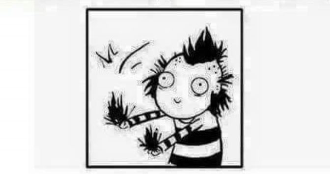

# OCR (Optical character recognition)
A simple application that can extract characters from a given image, let's say you have a book
of just images, and you can't copy the data from it, this application will read the images and produce a text file for each.

## How it works
the program relies on Matlab OCR tools for detecting the characters in the image, and 
produces a file to the given desctination, java is used to provide a more user friendly 
Interface for the user.

## dependencies
- Matlab: you need to install the computer vision toolbox (or generally the toolbox that ha OCR in it)
- JRE (Java runtime environment)

## Limitations and Future work
- the project only works on a single specified image, so it can't really solve the book problem above yet :smile:, so the future work is simply to make it handle that part, to open a given folder, read all images in it and make a book out of it.
- May be you want to write the output to something other than .txt files like .docx or something, but we won't do that, you want it, do it yourself :smile:.

## Participants
- Mohamed Abd-elmagid (me :smile:)
- Manar Arabi
- Mahmoud Atef
- Salma sayed

## finally

